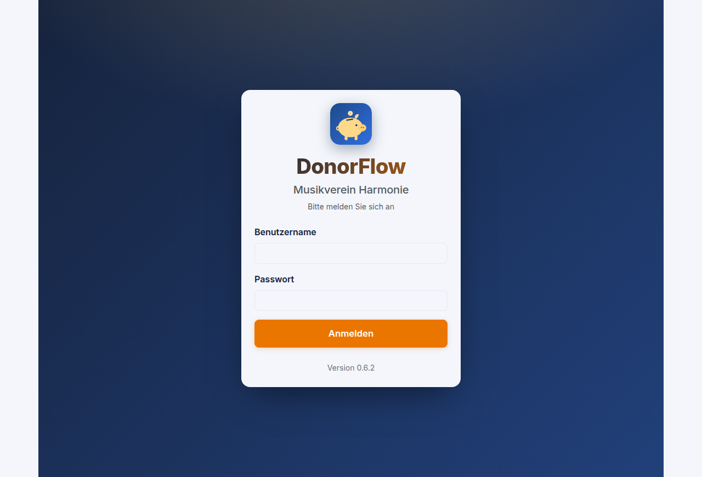
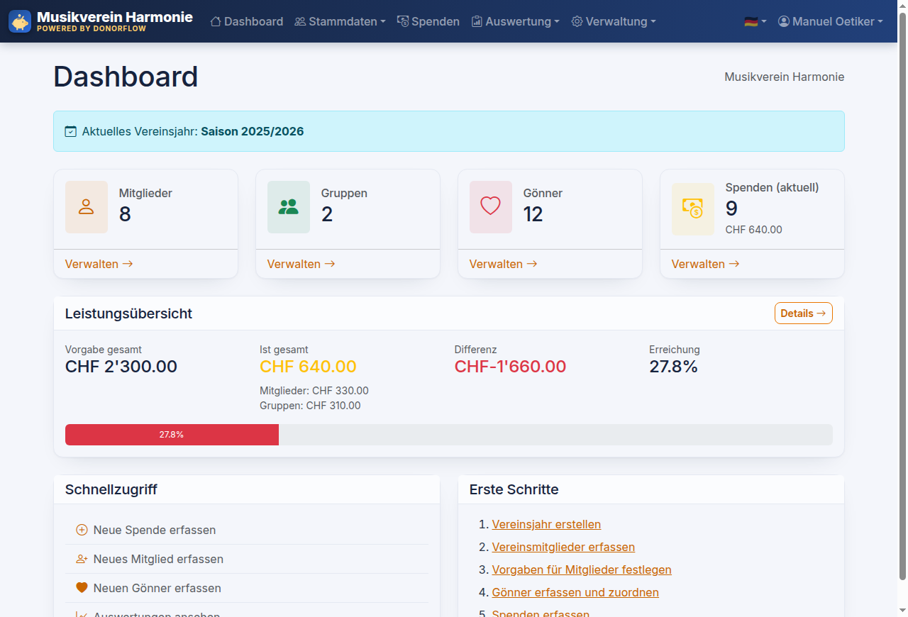
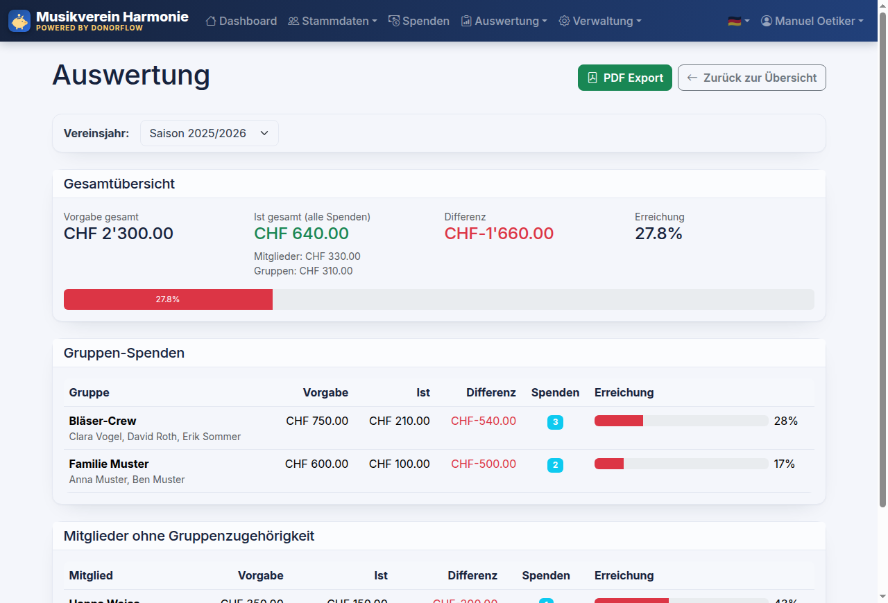
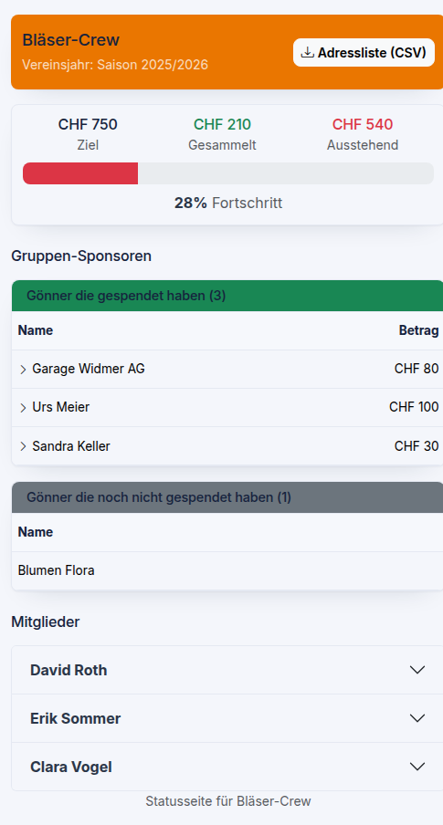
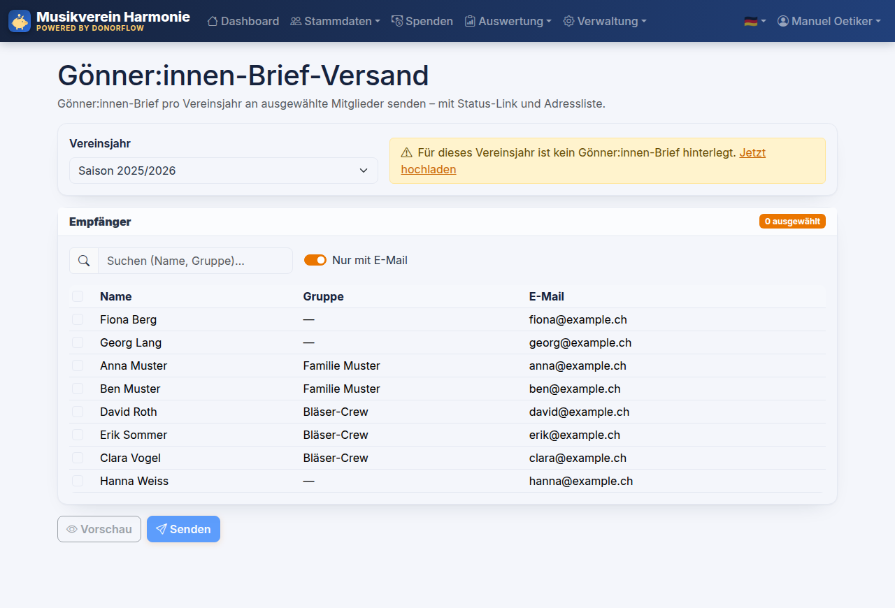
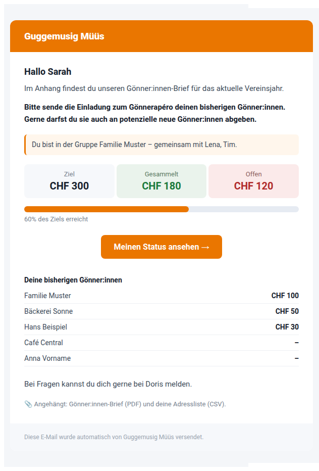
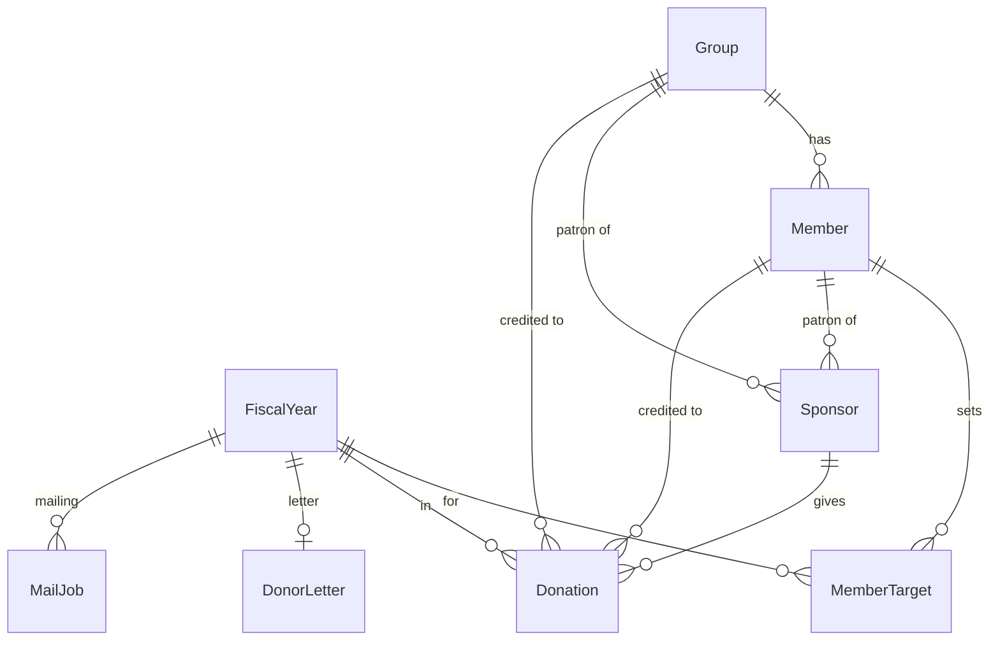

<div align="center">


# DonorFlow

**Donation management for clubs and associations.**

Track your patrons, set fiscal-year goals, watch the money come in live, and email every member a personalized donor letter in one click. Self-hosted, four languages.

`Next.js 16` · `TypeScript` · `Prisma + SQLite` · `NextAuth` · `MIT`



</div>

## Screenshots

|  |  |
|:--:|:--:|
| **Dashboard** | **Performance report** (PDF export) |
|  |  |
| **Public status link** (mobile, no login) | **Donor mailing** |
|  |  |

The personalized email each member receives:

<div align="center"></div>

## What it does

- **Members & patrons** — organize members, auto-group families/sections, assign each sponsor to a member **or** group
- **Donations & targets** — monetary + in-kind donations; one target per member per fiscal year; group target = sum of members
- **Reports** — live dashboard and per-member/group performance with **PDF export**
- **Status links** — public, tokenized, mobile-first progress pages per member and group
- **Donor mailing** — upload the season's letter (PDF), then email selected members their status, patron list, and the letter + address CSV, throttled and resumable
- **Four languages** — German, English, French, Italian, auto-detected, locale-aware formatting
- **Self-hosted** — SQLite, no external services

## Quick Start

```bash
npm install
npm run db:push
npm run dev          # → http://localhost:7526  (login: admin / admin)
```

With [mise](https://mise.jdx.dev): `mise install && mise run setup && mise run dev`.

## Deployment

Reproducible Podman build → tar → SSH to a systemd user service. Templates in [`deploy/`](deploy/).

```bash
cp deploy/deploy-config.example.sh deploy/deploy-config.production.sh
# edit with your server details, then:
./deploy.sh production
```

It bumps the version, builds Linux binaries in a container, uploads and backs up the previous release, preserves the database/`.env`/logs, syncs the schema, and restarts the service.

## Database Model



A sponsor belongs to a member **or** a group (exclusive) · targets are per member per fiscal year · one donor letter per fiscal year. `User` and `Setting` stand alone.

---

<div align="center">Created by <a href="mailto:manuel@oetiker.ch">Manuel Oetiker</a> · MIT License</div>
